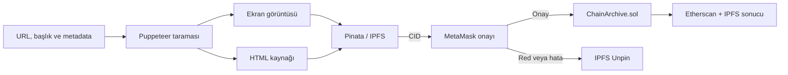

<div align="center">
  

  # ChainArchive

  **Web'in kaybolan anlarını IPFS ve Ethereum üzerinde doğrulanabilir bir dijital hafızaya dönüştürün.**

  [](https://react.dev/)
  [](https://www.typescriptlang.org/)
  [](https://sepolia.etherscan.io/)
  [](https://www.pinata.cloud/)
  [](https://soliditylang.org/)
</div>

---

## 🌐 Proje Hakkında

ChainArchive, internet üzerindeki içeriklerin zaman içinde değiştirilmesine, kaldırılmasına veya erişilemez hâle gelmesine karşı geliştirilen merkeziyetsiz bir web arşivleme uygulamasıdır.

Sistem, verilen web sayfasını görünmez bir tarayıcıyla ziyaret eder; sayfanın **JPEG ekran görüntüsünü** ve **HTML kaynağını** alarak Pinata üzerinden IPFS'e yükler. Oluşan IPFS CID değeri, orijinal URL ve blok zaman damgasıyla birlikte **Ethereum Sepolia** ağındaki akıllı sözleşmeye kaydedilir.

Böylece her arşiv için iki katmanlı bir doğrulama sağlanır:

- **IPFS**, arşiv dosyalarını içerik tabanlı bir adresle saklar.
- **Ethereum**, URL–CID eşleşmesini, arşivleyen cüzdanı ve zamanı değiştirilemez biçimde kayıt altına alır.

## ✨ Öne Çıkan Özellikler

### Arşivleme ve IPFS

- Web sayfalarını Puppeteer ile otomatik tarama
- En fazla 15.000 piksel yüksekliğinde JPEG ekran görüntüsü alma
- Sayfanın ekran görüntüsü ile HTML kaynağını aynı IPFS dizininde saklama
- Başlık, kategori, yazar, orijinal URL ve arşivleyen cüzdanı metadata olarak kaydetme
- Pinata JWT bulunmadığında geliştirme amaçlı sahte CID üretme
- Blokzincir işlemi iptal edilirse yüklenen içeriği Pinata'dan kaldırma

### Web3 ve doğrulama

- MetaMask ve EIP-1193 uyumlu cüzdan bağlantısı
- Kullanıcıyı otomatik olarak Ethereum Sepolia ağına yönlendirme
- URL ve IPFS CID değerlerini akıllı sözleşmeye kaydetme
- İşlem sonucunu Etherscan üzerinden görüntüleme
- IPFS ekran görüntüsüne ve HTML kaynağına doğrudan erişme

### Arama, geçmiş ve keşfet

- Bir URL'nin zincirdeki geçmiş arşivlerini sorgulama
- Bağlı cüzdana ait arşivleri listeleme
- Pinata'daki son ChainArchive kayıtlarını **Keşfet** ekranında görüntüleme
- Zincir olaylarını IPFS metadatasıyla birleştirme
- Arşiv kartlarında CID, işlem özeti, cüzdan, kategori ve tarih bilgilerini gösterme

### Backend güvenliği ve performansı

- Tekrar kullanılan global Puppeteer tarayıcı örneği
- API istekleri için IP başına dakikada 3 istek sınırı
- Yapılandırılabilir CORS kaynağı
- Windows ortamında kurulu Edge veya Chrome'u otomatik kullanma
- Zaman aşımı ve Pinata hatalarında kontrollü geri dönüş

## 🔄 Arşivleme Akışı



## 🧱 Sistem Mimarisi

```text
Kullanıcı ve MetaMask
        │
        ▼
┌──────────────────────┐
│  React Web Arayüzü   │
│  Arşivle · Sorgula   │
│  Geçmiş · Keşfet     │
└──────────┬───────────┘
           │ REST API                         Web3
           ▼                                  │
┌──────────────────────┐                      ▼
│   Express Backend    │          ┌────────────────────────┐
│ Puppeteer · Metadata │          │ Ethereum Sepolia       │
└──────────┬───────────┘          │ ChainArchive.sol       │
           │                      └────────────────────────┘
           ▼
┌──────────────────────┐
│    Pinata / IPFS     │
│ screenshot.jpg       │
│ source.html          │
└──────────────────────┘
```

## 🛠️ Teknoloji Yığını

| Katman | Teknolojiler |
| --- | --- |
| Kullanıcı arayüzü | React 19, TypeScript, Vite, Tailwind CSS |
| Web3 bağlantısı | ethers.js, MetaMask |
| Backend API | Node.js, Express, CORS, Express Rate Limit |
| Web tarama | Puppeteer, Chromium / Chrome / Edge |
| Dosya depolama | IPFS, Pinata API, Axios, FormData |
| Blokzincir | Ethereum Sepolia, Solidity 0.8.24 |
| Sözleşme araçları | Hardhat, Hardhat Ignition |
| Arayüz ikonları | Lucide React |

## 📁 Proje Yapısı

```text
chainarchive/
├── backend/
│   ├── index.js                      # Crawler, IPFS ve metadata API'si
│   ├── .env.example                  # Backend ortam değişkeni örneği
│   └── package.json
├── blockchain/
│   ├── contracts/
│   │   └── ChainArchive.sol          # Arşiv akıllı sözleşmesi
│   ├── ignition/modules/
│   │   └── ChainArchive.cjs          # Hardhat dağıtım modülü
│   ├── hardhat.config.cjs            # Sepolia ve artifact yapılandırması
│   └── .env.example
├── frontend/
│   ├── public/                       # Logo ve statik dosyalar
│   ├── src/
│   │   ├── artifacts/                # Derlenen sözleşme çıktıları
│   │   ├── App.tsx                   # Ana uygulama ve Web3 akışları
│   │   └── main.tsx                  # React giriş noktası
│   ├── vite.config.ts
│   └── package.json
└── README.md
```

## ⛓️ Akıllı Sözleşme

ChainArchive sözleşmesi her arşiv için aşağıdaki verileri saklar:

| Alan | Açıklama |
| --- | --- |
| `url` | Arşivlenen sayfanın orijinal adresi |
| `cid` | IPFS üzerindeki içerik kimliği |
| `archiver` | İşlemi imzalayan cüzdan adresi |
| `timestamp` | Kaydın blok zaman damgası |

Yeni kayıtlar `ArchiveCreated` olayıyla yayınlanır. Frontend; URL sorgusu, kullanıcı geçmişi ve keşfet doğrulaması için bu olayları okur.

| Bilgi | Değer |
| --- | --- |
| Ağ | Ethereum Sepolia |
| Chain ID | `11155111` |
| Sözleşme | [`0xA98D252939c9E8413CB98Aa665dcA7384727F9AA`](https://sepolia.etherscan.io/address/0xA98D252939c9E8413CB98Aa665dcA7384727F9AA) |

## 🚀 Kurulum

### Gereksinimler

- Node.js `>=20.19`
- npm
- MetaMask veya EIP-1193 uyumlu bir tarayıcı cüzdanı
- İşlem ücretleri için Sepolia test ETH
- Gerçek IPFS yüklemeleri için Pinata hesabı ve JWT

### 1. Bağımlılıkları yükleyin

Her modül bağımsız bir Node.js projesidir:

```bash
cd backend
npm install

cd ../frontend
npm install

cd ../blockchain
npm install
```

### 2. Backend'i yapılandırın

Örnek ortam dosyasını kopyalayın:

```bash
cd backend
cp .env.example .env
```

PowerShell kullanıyorsanız:

```powershell
Copy-Item .env.example .env
```

`backend/.env` dosyasını düzenleyin:

```env
# Gerçek IPFS yüklemeleri için gerekli
PINATA_JWT=pinata_jwt_degeriniz

# İsteğe bağlı; varsayılan değer http://localhost:5173
FRONTEND_URL=http://localhost:5173

# İsteğe bağlı; varsayılan değer 3001
PORT=3001
```

> `PINATA_JWT` tanımlanmazsa arşivleme endpoint'i geliştirme amacıyla sahte bir CID döndürür. Bu CID IPFS'te bulunmaz; metadata ve keşfet özellikleri için geçerli bir Pinata JWT gerekir.

### 3. Frontend'i yapılandırın

Yerel geliştirmede ek ayar gerekmez. Backend başka bir adreste çalışıyorsa `frontend/.env` oluşturun:

```env
VITE_BACKEND_URL=http://localhost:3001
```

> Pinata JWT değerini frontend ortamına koymayın. Gizli anahtar gerektiren IPFS işlemleri backend üzerinden gerçekleştirilir.

### 4. Uygulamayı çalıştırın

İki ayrı terminal açın.

Backend:

```bash
cd backend
node index.js
```

Frontend:

```bash
cd frontend
npm run dev
```

| Servis | Varsayılan adres |
| --- | --- |
| Web arayüzü | `http://localhost:5173` |
| Backend API | `http://localhost:3001` |

## 🧭 Nasıl Kullanılır?

1. Backend ve frontend servislerini başlatın.
2. Arayüzde **Cüzdanı Bağla** düğmesine basın.
3. MetaMask üzerinden hesabınızı bağlayın; uygulama gerekirse Sepolia ağına geçmenizi ister.
4. Arşivlenecek URL'yi girin ve isteğe bağlı metadata alanlarını doldurun.
5. **Arşivle** düğmesine basarak tarama ve IPFS yüklemesini başlatın.
6. MetaMask'ta blokzincir işlemini onaylayın.
7. Sonuç ekranından IPFS içeriğini ve Etherscan işlem kaydını inceleyin.

Bir adresin önceki kayıtlarını görmek için **Sorgula**, genel arşiv akışını görmek için **Keşfet** bölümünü kullanabilirsiniz. Cüzdan bağlandığında aynı hesapla oluşturduğunuz kayıtlar ana sayfada ayrıca listelenir.

## 🔌 API Uç Noktaları

| Yöntem | Uç nokta | Açıklama |
| --- | --- | --- |
| `POST` | `/api/archive` | Sayfayı tarar; ekran görüntüsünü ve HTML'i IPFS'e yükler |
| `POST` | `/api/metadata` | Verilen CID listesi için Pinata metadatasını döndürür |
| `GET` | `/api/explore` | Pinata'daki son ChainArchive kayıtlarını listeler |
| `DELETE` | `/api/unpin` | İptal edilen arşivin CID'sini Pinata'dan kaldırır |

Tüm `/api/*` istekleri IP adresi başına dakikada en fazla 3 istekle sınırlandırılmıştır.

## 🧪 Geliştirme Komutları

```bash
# Frontend geliştirme sunucusu
cd frontend
npm run dev

# Frontend statik analiz
npm run lint

# Frontend üretim derlemesi
npm run build

# Akıllı sözleşmeyi derleme
cd ../blockchain
npx hardhat compile
```

## 📦 Sözleşmeyi Sepolia'ya Dağıtma

Yalnızca sözleşmeyi değiştirecek veya yeni bir dağıtım yapacaksanız `blockchain/.env` dosyasını oluşturun:

```env
SEPOLIA_RPC_URL=https://eth-sepolia.g.alchemy.com/v2/anahtariniz
PRIVATE_KEY=dagitim_cuzdaninin_ozel_anahtari
```

Dağıtımı başlatın:

```bash
cd blockchain
npx hardhat ignition deploy ignition/modules/ChainArchive.cjs --network sepolia
```

Hardhat artifact dosyaları otomatik olarak `frontend/src/artifacts/` dizinine yazılır. Yeni dağıtımdan sonra `frontend/src/App.tsx` içindeki `CONTRACT_ADDRESS` değerini yeni adresle güncelleyin.

> Gerçek varlık tuttuğunuz bir cüzdanın özel anahtarını kullanmayın. `.env` dosyalarını ve özel anahtarları sürüm kontrolüne kesinlikle eklemeyin.

## 📝 Geliştirme Notları

- Arşiv ekran görüntüsü JPEG biçiminde, `1280px` genişlik ve en fazla `15000px` yükseklikle oluşturulur.
- IPFS dizininde `screenshot.jpg` ve `source.html` dosyaları bulunur.
- Metadata ve keşfet sonuçları, backend'in bağlı olduğu Pinata hesabındaki `ChainArchive_` önekli pinlerden alınır.
- Blockchain yalnızca doğrulama verilerini saklar; ekran görüntüsü ve HTML dosyaları zincire yazılmaz.
- Bazı siteler bot koruması, oturum gereksinimi veya dinamik içerik nedeniyle eksik görüntülenebilir.
- Üretim ortamında `FRONTEND_URL` ve `VITE_BACKEND_URL` değerleri dağıtım adresleriyle değiştirilmelidir.

---

<div align="center">
  <strong>ChainArchive — Dijital hafıza, zincir üzerinde doğrulandı.</strong>
</div>
